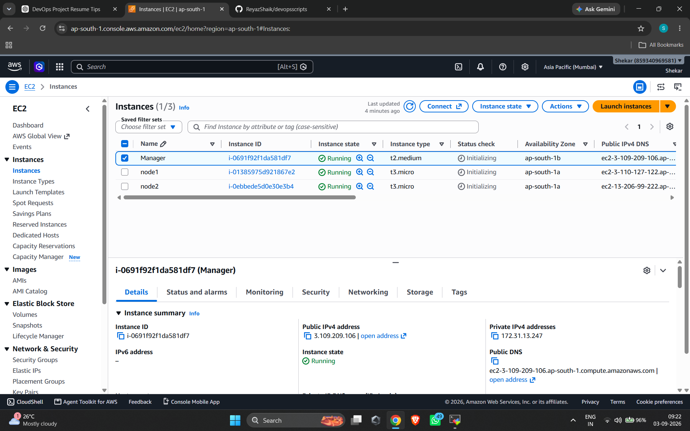
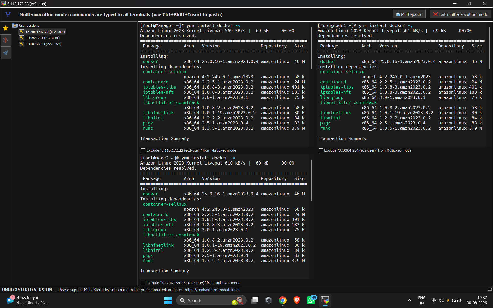
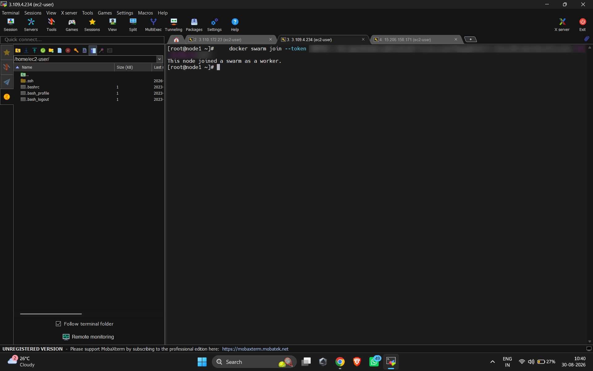
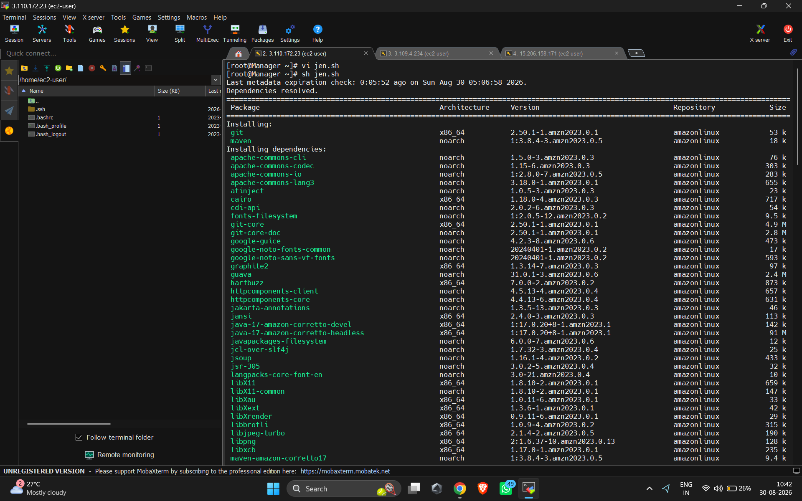
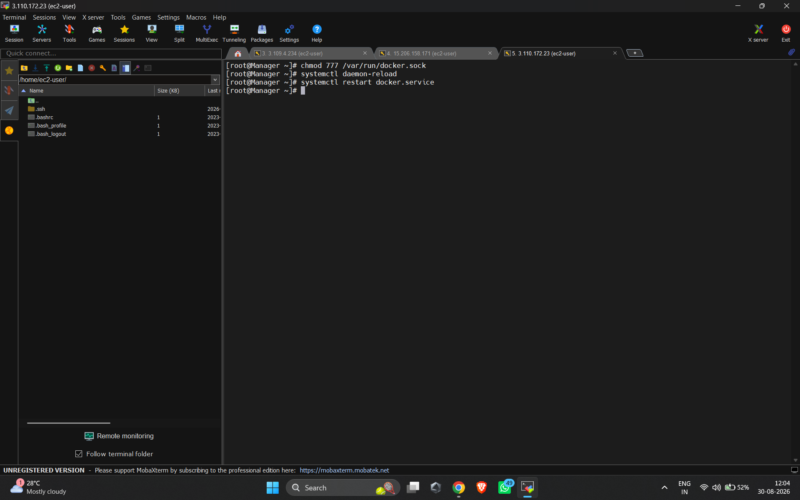
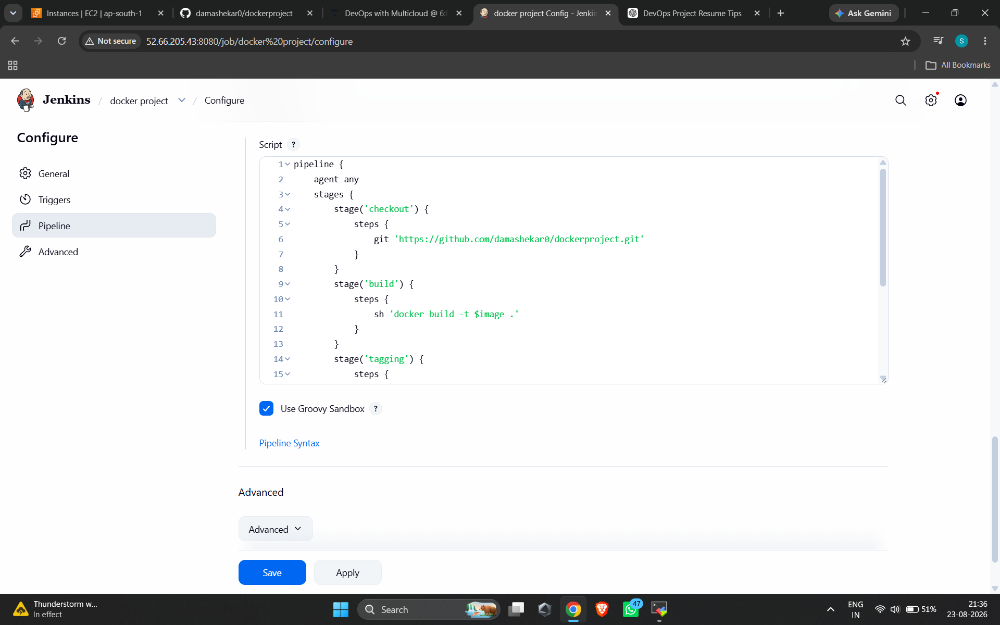
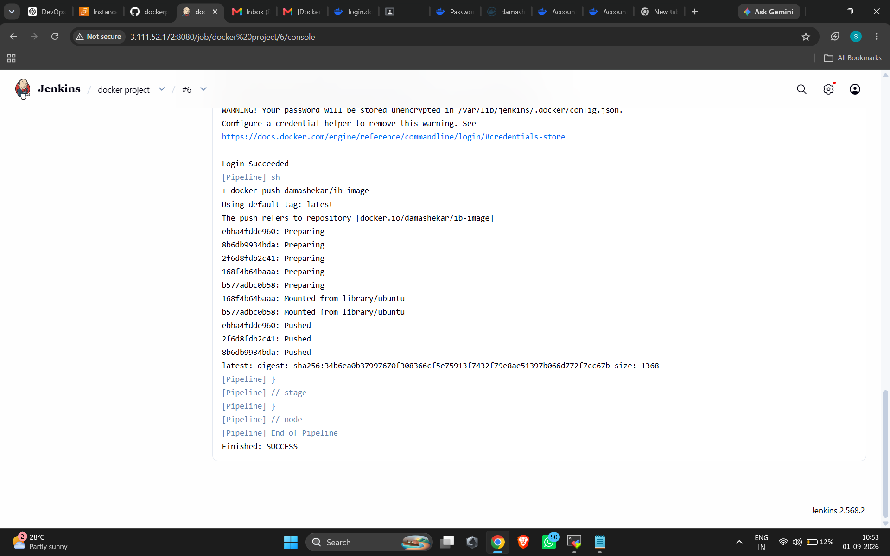
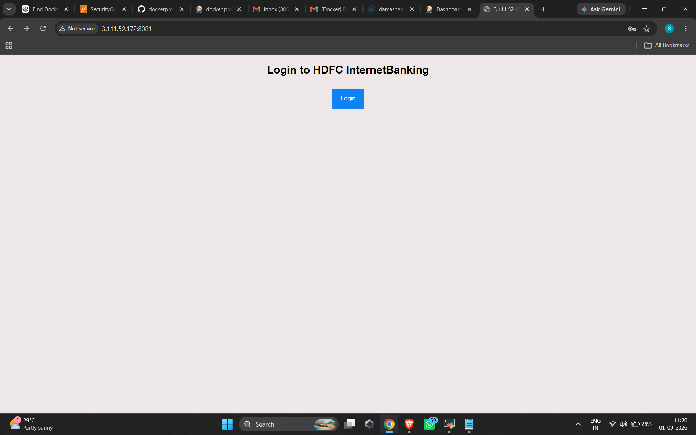
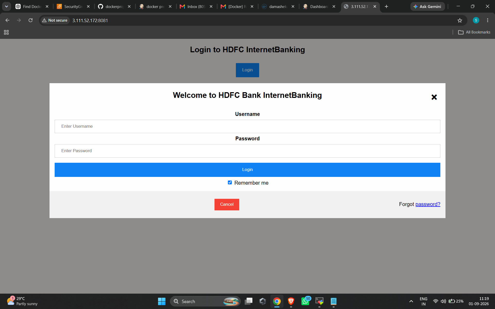

# 🐳 Docker Swarm with Jenkins CI/CD

A complete CI/CD project on AWS: **Jenkins** builds Docker images from GitHub, pushes them to **Docker Hub**, and deploys them as replicated services on a **Docker Swarm** cluster using `docker stack`.

---

## 📌 Project Overview

| Item | Details |
|------|---------|
| Cloud | AWS EC2 (Amazon Linux 2023, Mumbai region) |
| Cluster | Docker Swarm – 1 Manager + 2 Workers |
| CI/CD | Jenkins Pipeline (parameterized) |
| Registry | Docker Hub |
| Source | GitHub (`Dockerfile` + `docker-compose.yml`) |
| Apps | InternetBanking, MobileBanking, Insurance, Loans |

## 🔄 Workflow

```
GitHub  ──►  Jenkins Pipeline  ──►  Docker Build  ──►  Tag  ──►  Push (Docker Hub)  ──►  docker stack deploy (Swarm)
```

Pipeline stages: **checkout → build → tag → push → deploy**

## 🖥️ Infrastructure

| Node | Instance Type | Role |
|------|---------------|------|
| Manager | t2.medium | Swarm manager + Jenkins |
| node1 | t3.micro | Swarm worker |
| node2 | t3.micro | Swarm worker |

---

## 🚀 Step-by-Step Implementation

### Step 1: Launch EC2 Instances
Launch 3 Amazon Linux 2023 instances: `Manager`, `node1`, `node2`. Open the required ports in the Security Group (22, 8080 for Jenkins, 2377/7946/4789 for Swarm, and the app ports).



### Step 2: Install Docker on All Nodes
Connect to all 3 machines with MobaXterm, enable **MultiExec** mode and run:

```bash
sudo -i
yum install -y docker
systemctl start docker
systemctl enable docker
```



### Step 3: Set Hostnames

```bash
hostnamectl set-hostname manager   # on manager
hostnamectl set-hostname node1     # on worker 1
hostnamectl set-hostname node2     # on worker 2
```

### Step 4: Initialize Docker Swarm
On the **Manager**:

```bash
docker swarm init
```

Copy the join command it prints and run it on **node1** and **node2**:

```bash
docker swarm join --token <SWARM_TOKEN> <MANAGER_PRIVATE_IP>:2377
```



Verify on the Manager:

```bash
docker node ls
```

### Step 5: Install Jenkins on the Manager
Jenkins is installed using a shell script (Java 17, Maven, Git and Jenkins).

```bash
vi jen.sh        # paste the script
sh jen.sh
```

Open `http://<MANAGER_PUBLIC_IP>:8080`, unlock Jenkins and install the suggested plugins.



### Step 6: Allow Jenkins to Use Docker
Run on the Manager so the Jenkins user can access the Docker daemon:

```bash
chmod 777 /var/run/docker.sock
systemctl daemon-reload
systemctl restart docker.service
```



> ⚠️ `chmod 777` is fine for a demo/lab. In production add the `jenkins` user to the `docker` group instead.

### Step 7: Create the Jenkins Pipeline
1. New Item → **Pipeline** → name it `docker project`.
2. Tick **This project is parameterized** and add two *Choice parameters*:

| Parameter | Choices |
|-----------|---------|
| `image` | `internetbanking:v1`, `mobilebanking:v1`, `insurance:v1`, `loans:v1` |
| `repo` | `damashekar/ib-image`, `damashekar/mb-image`, `damashekar/insurance-image`, `damashekar/loans-image` |

3. Store the Docker Hub password securely (Jenkins Credentials, or `Manage Jenkins → System → Environment variables`).

Pipeline script:

```groovy
pipeline {
    agent any

    stages {
        stage('checkout') {
            steps {
                git 'https://github.com/damashekar0/dockerproject.git'
            }
        }
        stage('build') {
            steps {
                sh 'docker build -t $image .'
            }
        }
        stage('tag') {
            steps {
                sh 'docker tag $image $repo'
            }
        }
        stage('push') {
            steps {
                sh 'docker login -u damashekar -p $password'
                sh 'docker push $repo'
            }
        }
        stage('deploy') {
            steps {
                sh 'docker stack deploy bank -c docker-compose.yml'
            }
        }
    }
}
```



### Step 8: Run the Build and Push to Docker Hub
Click **Build with Parameters**, pick an `image` and its matching `repo`. A successful run logs in to Docker Hub, pushes the image and ends with `Finished: SUCCESS`.



Repeat for each application (change `index.html` in GitHub → build with the next image/repo pair) so that all 4 images exist in Docker Hub.

### Step 9: Deploy with Docker Stack
`docker-compose.yml` runs each app with **3 replicas** spread across the swarm nodes:

```yaml
version: '3.8'
services:
  internetbanking:
    image: damashekar/ib-image:latest
    ports:
      - "8081:80"
    deploy:
      replicas: 3
  mobilebanking:
    image: damashekar/mb-image:latest
    ports:
      - "8082:80"
    deploy:
      replicas: 3
  insurance:
    image: damashekar/insurance-image:latest
    ports:
      - "8083:80"
    deploy:
      replicas: 3
  loan:
    image: damashekar/loans-image:latest
    ports:
      - "8084:80"
    deploy:
      replicas: 3
```

Useful commands on the Manager:

```bash
docker stack ls
docker stack services bank
docker stack ps bank
docker service ls
```

### Step 10: Access the Application
Open `http://<ANY_NODE_PUBLIC_IP>:8081` – the Swarm routing mesh serves the app from any node.





---

## ✅ Key Learnings
- Building a multi-node Docker Swarm cluster on AWS
- Parameterized Jenkins pipelines (one pipeline, many images)
- Image tagging and pushing to Docker Hub
- High availability with replicated services using `docker stack deploy`

## 🔐 Security Notes
- Never hard-code the Docker Hub password; use **Jenkins Credentials**.
- Do not commit Swarm join tokens or public IPs.
- Avoid `chmod 777 /var/run/docker.sock` in production.

## 🔮 Future Improvements
- GitHub webhook / SCM polling trigger
- Use Jenkins Credentials binding instead of plain-text password
- Add Docker Swarm visualizer and monitoring (Prometheus + Grafana)
- Image versioning with build numbers instead of `latest`

## 👤 Author
**Shekar** – DevOps Learner
